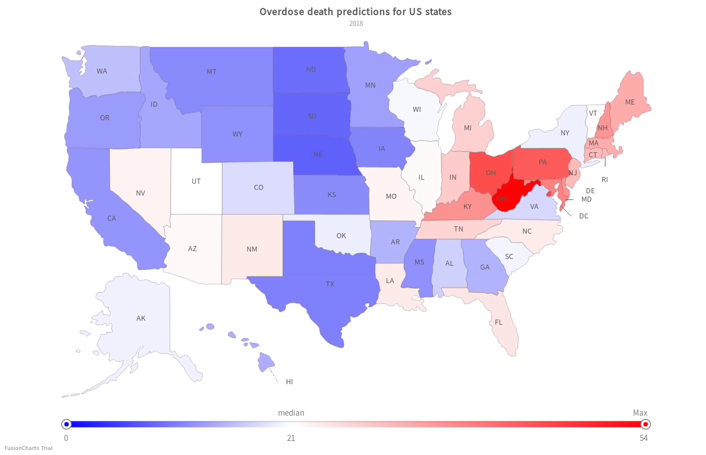
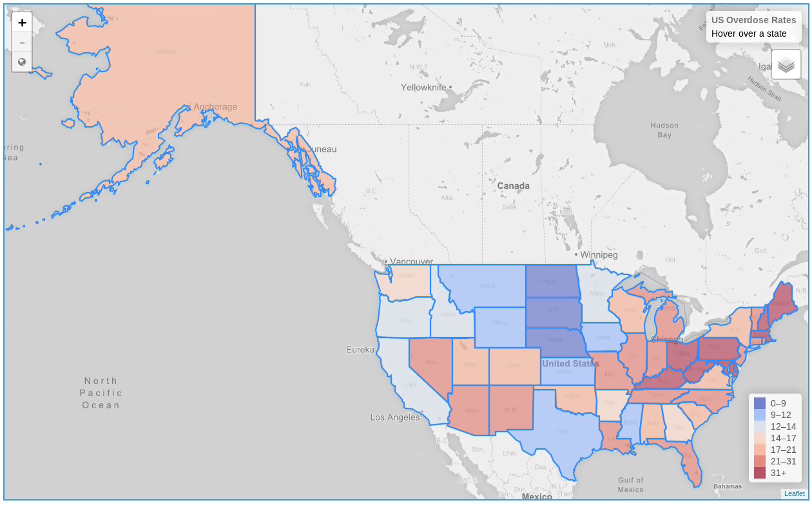
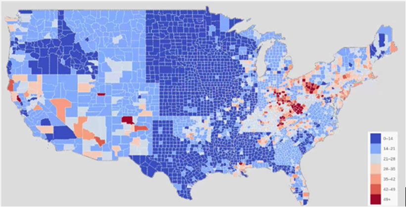

# Dynamic Overdose Vulnerability Estimator (DOVE) 
### Visualization in javascript

#### I developed 2 models for translating a CSV file with overdose data into an interactive webpage which displays a heatmap of the data
##### Model 1: fusioncharts

##### Model 2: leaflet

